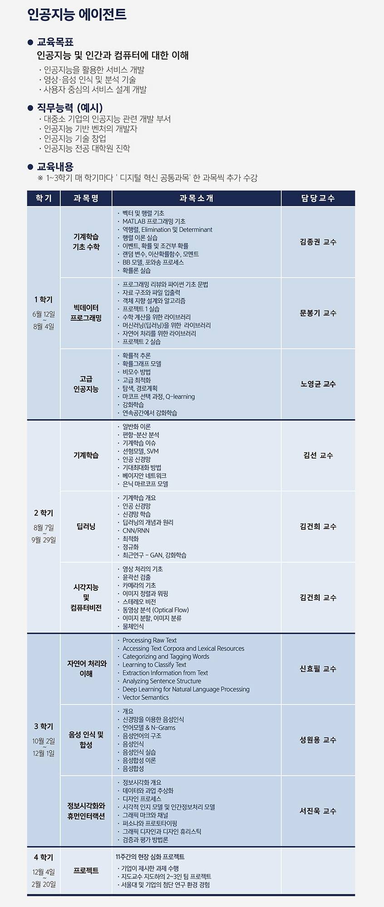

# FIRA AI-Agent 2017

서울대학교 빅데이터 연구소(BDI) [인공지능 에이전트 과정](http://bdi.snu.ac.kr/academy/?page_id=52) 수강 기록(2017.06-2018.02)

- 1학기
    + 컴퓨터 비전 - 김건희 교수님
    + 기계학습 기초수학(선형대수, 확률모형) - 김종권 교수님
    + 빅데이터 프로그래밍 - 문봉기 교수님
- 2학기
    + 기계학습 - 김선 교수님
    + 딥러닝 - 김건희 교수님
    + 고급 인공지능 - 노영균 교수님
- 3학기
    + 자연어처리 - 신효필 교수님
    + 음성 인식 - 성원용 교수님
    + 정보 시각화, HCI - 서진욱 교수님
- 4학기
    + 기업 혹은 대학원 연구실에서 프로젝트 진행

